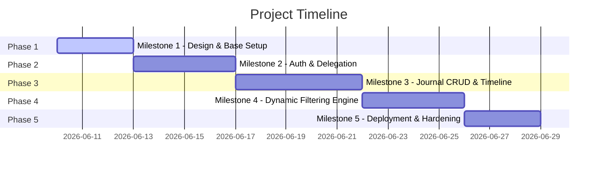

# Project Plan: My Monitored Morning (V1)

## 1. High-Level Milestones & Target Schedule

We will execute the development of *My Monitored Morning* using a phased, iterative approach. Each milestone results in a testable, working segment of the application.

| Milestone | Target Duration | Core Deliverables | Focus |
| :--- | :--- | :--- | :--- |
| **Milestone 1** | 3 Days | Web App Skeleton, CSS Design System | Modern Typography, Sleek Theme, Layout |
| **Milestone 2** | 4 Days | Firebase Auth, Patient/Caregiver Profiles | Multi-user Auth, Delegation Permissions |
| **Milestone 3** | 5 Days | Journal Entry Form, Daily Timeline, Details | CRUD Actions, Dynamic Tagging |
| **Milestone 4** | 4 Days | Interactive Filters (Tags, Author, Date) | Combined Firestore Queries & Logic |
| **Milestone 5** | 3 Days | Firestore Security Rules, GCP Hosting Prep | Production Hardening, Build Validation |

---

## 2. Detailed Task Breakdown & Acceptance Criteria

### Milestone 1: Project Setup & Core Design System
*   **Task 1.1: Web Environment Setup**
    *   *Input:* Empty directory, modern web guidelines.
    *   *Expected Output:* Configured Vite + React environment.
    *   *Acceptance Criteria:* Vite + React environment is fully set up, compiles cleanly, local dev server (`npm run dev`) launches instantly, and simple homepage displays.
*   **Task 1.2: Global Design System & Theme**
    *   *Input:* Custom CSS tokens and premium palette guidelines.
    *   *Expected Output:* `index.css` defining global variables (sleek dark/light theme, modern typography like Outfit/Inter, smooth transitions, and responsive grid system).
    *   *Acceptance Criteria:* Global layout works gracefully on both a mobile screen and wide desktop. Visuals look high-end, premium, and clean, using rich HSL color selections.

### Milestone 2: Security, Authentication & Delegation (Multi-User)
*   **Task 2.1: Authentication Implementation**
    *   *Input:* Firebase/Firestore Auth configurations.
    *   *Expected Output:* Secure login, register, and logout flows.
    *   *Acceptance Criteria:* Users can register and sign in. Erroneous logins display elegant validation messages. Session state is preserved.
*   **Task 2.2: Caregiver Delegation & Profile Switching**
    *   *Input:* Firestore database design.
    *   *Expected Output:* A delegation system where patients can add caregivers via email/ID, and caregivers have a "profile switcher" to act on behalf of patients.
    *   *Acceptance Criteria:* 
        *   Patient can invite a caregiver.
        *   Caregiver can log in, see a list of delegated patients, and select which patient profile they are active under.
        *   The active profile state is globally maintained.

### Milestone 3: Journal Database & CRUD Operations
*   **Task 3.1: Firestore Schema & CRUD Hook**
    *   *Input:* Firestore collections specification (`journal_entries` schema: `id`, `patientId`, `authorId`, `authorName`, `timestamp`, `notes`, `tags`).
    *   *Expected Output:* Database helper files/hooks for Create, Read, Update, and Delete actions.
    *   *Acceptance Criteria:* All records created by a caregiver store `authorId` as the caregiver and `patientId` as the active patient. 
*   **Task 3.2: Master-Detail Daily Timeline**
    *   *Input:* Journal records dataset.
    *   *Expected Output:* An interactive, advanceable daily timeline (Master View) showing daily snippets, and a drill-down Drawer or Modal (Detail View).
    *   *Acceptance Criteria:* Timeline is grouped by date, supports pagination or endless scroll, and clicking an entry displays full metadata.
*   **Task 3.3: Rich Entry Editor (CRUD Form with Dynamic Tags)**
    *   *Input:* Dynamic tags requirements (e.g., `#bloodGlucose`).
    *   *Expected Output:* Form to add/edit entries with inline text-tag parsing or dedicated tag selector.
    *   *Acceptance Criteria:* Users can type or select tags, tags are parsed dynamically, and modifications are persisted instantly to Firestore. Delete option requires user confirmation.

### Milestone 4: Dynamic Filtering Engine
*   **Task 4.1: Filter UI Panel**
    *   *Input:* Modern CSS and interactive design principles.
    *   *Expected Output:* A premium responsive side panel or collapsible header containing dynamic selectors (multi-select tag pills, author dropdown, date picker).
    *   *Acceptance Criteria:* Filters can be combined (e.g., show only entries created by "Caregiver John" that have tag `#seizure` in the "Last 7 days").
*   **Task 4.2: Combined Multi-Query Engine**
    *   *Input:* Firestore query rules.
    *   *Expected Output:* Optimization logic to fetch and filter records efficiently.
    *   *Acceptance Criteria:* Dynamic filters combine gracefully without throwing runtime index errors.

### Milestone 5: Production Readiness & Google Cloud Prep
*   **Task 5.1: Firestore Security Rules**
    *   *Input:* Security specification.
    *   *Expected Output:* Strict `firestore.rules` preventing unauthorized reads or writes.
    *   *Acceptance Criteria:* Caregivers can only read/write records for patients who have delegated access to them. Patients can only read/write their own records.
*   **Task 5.2: GCP Build & Hosting Configuration**
    *   *Input:* Deployment constraints.
    *   *Expected Output:* Standardized configuration files (e.g., `firebase.json`, CI/CD build scripts or target configs).
    *   *Acceptance Criteria:* Application bundles successfully via `npm run build` with zero compiler/lint errors.

---

## 3. Risks, Technical Constraints & Mitigations

| Risk | Impact | Likelihood | Mitigation Strategy |
| :--- | :--- | :--- | :--- |
| **Firestore Composite Index Errors:** Dynamic filters across multiple fields (e.g., patient, author, tag, timestamp) can cause Firestore to fail unless proper indices are created. | **High** | **High** | 1. Implement client-side filtering on top of query results if index generation is too complex for V1. 2. Build queries progressively and catch index-required exceptions to generate index links early during development. |
| **Caregiver Permission Creep:** Caregivers accessing records they shouldn't, violating user privacy. | **Critical** | **Low** | 1. Enforce validation at the Firestore Security Rules level, not just client-side UI logic. 2. Run dedicated security test cases (mocking illegal read attempts) in Milestone 5. |
| **Tag Standardization Issues:** Freeform typing of tags might lead to duplicates like `#bloodglucose` vs `#bloodGlucose`. | **Medium** | **High** | 1. Build a tag suggestion dropdown showing previously used tags to encourage standardization. 2. Normalize tags to lowercase internally or provide auto-formatting in the input form. |
| **Offline Synchronization:** Users logging medical data in hospitals or clinics with poor internet connection. | **Medium** | **Medium** | 1. Enable Firestore offline persistence so data logs locally and syncs automatically when a connection is restored. |
